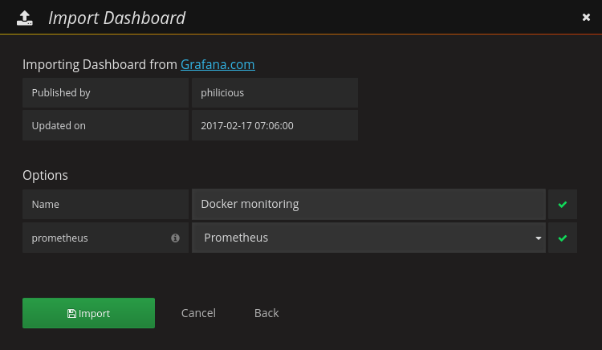

# Monitoring

Docker compose file for setting up [Grafana](https://grafana.com/), [Prometheus](https://prometheus.io/), and [cadvisor](https://github.com/google/cadvisor) for docker container monitoring.

## Usage

1. Start docker containers

```
git clone https://github.com/jlab-sensing/monitoring.git
cd monitoring
docker compose up -d
```

2. Navigate to the grafana portal on port `3000`. Replace `<hostname>` with the hostname/ip of the sever. Login using the default username and password is `admin` and `admin` respectively. It is advisable to create user accounts after initial login.

3. Add a new data using these settings


4. Import new dashboard with id of `193`. Set the data source to `Prometheus`.



## References

- https://blog.eleven-labs.com/en/monitor-your-docker-containers/
